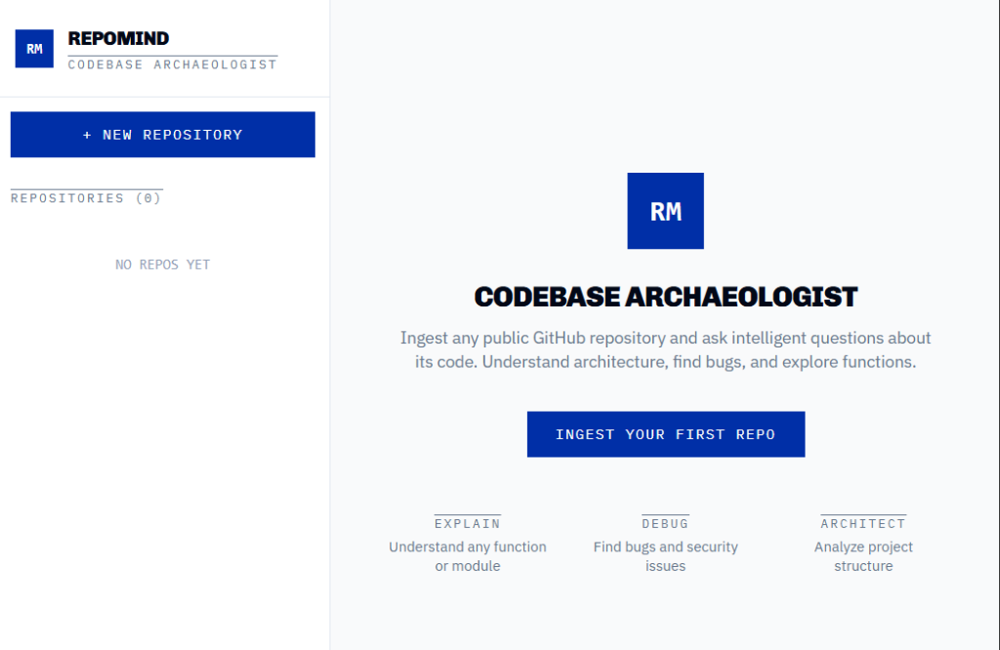
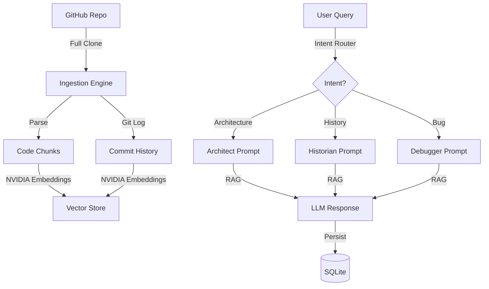

# RepoMind: Codebase Archaeologist 🏛️🔍

**RepoMind** is a production-grade codebase analysis platform that transforms GitHub repositories into interactable knowledge bases. Unlike standard RAG tools, RepoMind is history-aware—it doesn't just know what the code *is*, it knows *why* it changed.



---

## 🚀 Key Features

- **Semantic Commit Analysis:** Deep integration with `GitPython` to ingest full commit logs. Ask why a specific function was modified or track the evolution of a feature.
- **ChatGPT-Style Conversational Memory:** Remembers context across messages. Ask follow-up questions seamlessly within a single window per repository.
- **Multi-Vector Storage:** Flexibility to use **ChromaDB** for local development or **Pinecone** for production-scale deployments.
- **Intelligent Intent Routing:** Automatically detects if you're asking about **Architecture**, **Bugs**, **Evolution (History)**, or **Feature Implementation** to provide tailored responses.
- **Persistent Storage:** Built on a robust **SQLite + SQLAlchemy** backend. Your repositories, ingestion reports, and chat histories are saved permanently.

---

## 🛠️ Technology Stack

| Layer | Technology |
|---|---|
| **AI/LLM** | NVIDIA NIM (llama-3.1-70b), NVIDIA Embeddings |
| **Backend** | FastAPI, SQLAlchemy, GitPython |
| **Database** | SQLite (Metadata), ChromaDB/Pinecone (Vectors) |
| **Frontend** | React, Tailwind CSS, Lucide Icons |
| **Parsing** | Recursive code chunking with metadata tagging |

---

## 🏗️ Architecture



---

## 🏁 Getting Started

### 1. Prerequisites
- Python 3.9+
- Node.js 18+
- [NVIDIA NIM API Key](https://build.nvidia.com/)

### 2. Backend Setup
```bash
cd backend
python -m venv venv
source venv/bin/activate  # .\venv\Scripts\activate on Windows
pip install -r requirements.txt
cp .env.example .env
```
Update your `.env` with:
- `NVIDIA_API_KEY`: Your NVIDIA API key.
- `ENV`: `development` (Chroma) or `production` (Pinecone).

Run the server:
```bash
uvicorn server:app --reload
```

### 3. Frontend Setup
```bash
cd frontend
npm install
npm start
```
Open [http://localhost:3000](http://localhost:3000) to start your first excavation!

---

## 📜 License
MIT License. See `LICENSE` for details.

---
*Built with ❤️ for developers who love diving deep into codebases.*
